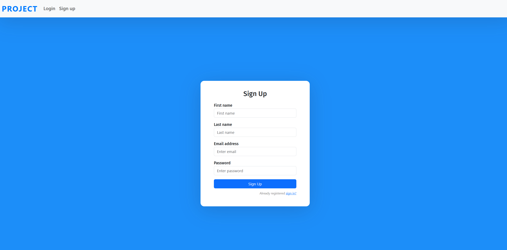
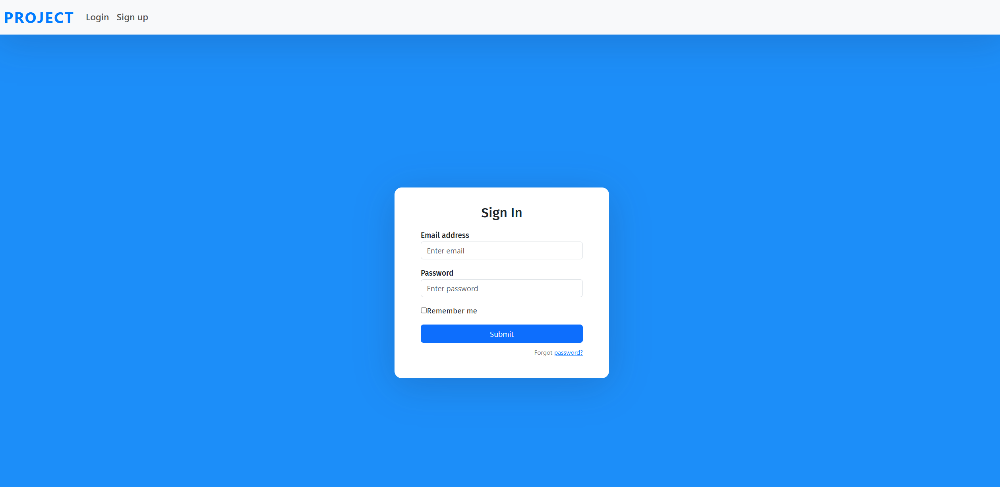
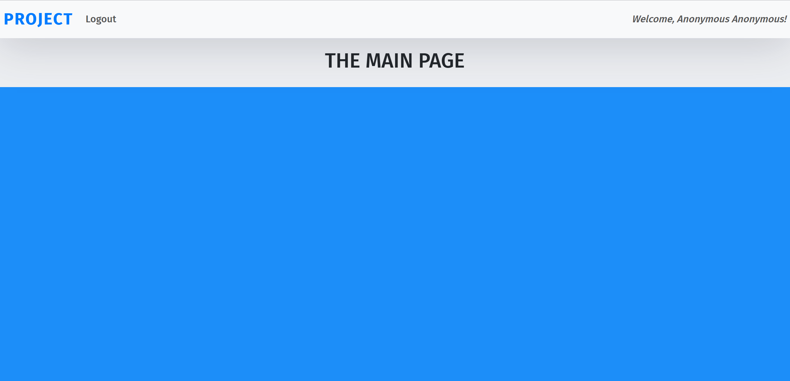

# fast-react

## Combine React and FAST-API instantly.

This is a template with boilerplate code for REACT frontend, connected with FASTAPI backend, that can be implemented into any project without any hassle.

## How it works:

React app acts as the frontend UI, and deals with the user input. Make sure fastapi is up and running too, so that it can accept the data from UI, and send appropriate response.

You can integrate any Machine Learning models, or full stack development, or anything. The world is your oyester.

### Procedure:

In order to run both frontend and backend, enter the following commands:

1. Clone this repository to your file location.
   `git clone https://github.com/S-acharya57/fast-react.git`

2. Replace the IP if needed in both `fastapi` code and `React` app.
3. Write your code in `mainpage.component.js` inside `src/components` inside `react-app` directory. You can add more code in fastapi and send request to them from frontend, in a similar way as signup and login.
4. Run the fastapi server to accept requests from frontend.
   `uvicorn main:app --reload`

5. Run the React app too, and enjoy!
   `cd react-app` and
   `npm start`

### Results:

1. Sign-Up Page
   
2. Login page
   
3. Main Page
   
